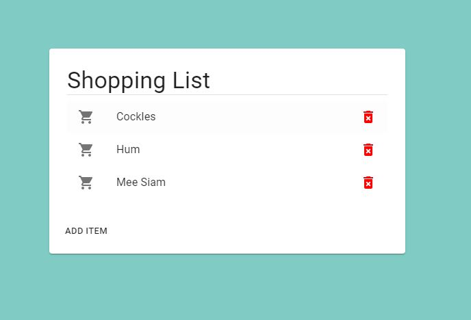

# 2. The Final Product

## UI-UX Design

Before we start designing the app, it is a good idea to plan out what the app might look like. In this demo, we will be creating a shopping list like the one below:



Make a mental note of the components and their hierarchies that we will have to code:

```
- Card
	- Title
	- Divider
	- List
		- ListIcon
		- ListItem
		- DeleteIcon
	- Button
```

!!! tip "UI-UX Design"
	For large projects, UI-UX design is a significant part of the development process and developers often use applications such as Figma or Adobe XD to design their user interfaces. For small projects, doodling on paper or Microsoft PowerPoint would be sufficient.

!!! question "Bottom-up or Top-down?"
	Should you start developing the components from bottom-up (i.e. the most deeply nested component in the hierarchy to the outermost) or top-down (vice-versa)?

	There is no correct option, it depends on the developer's preference. For beginners, I recommend the top-down option, which we will follow in this project. 

## App Behaviour


The reason why we are using React to create our web app (instead of traditional HTML/CSS/JS) is because React provides an easy framework for us to create interactive applications that are responsive to user input (e.g. mouse click, key press, hover etc.). React is also very common in [single page applications](https://medium.com/@NeotericEU/single-page-application-vs-multiple-page-application-2591588efe58).

In our shopping list, users will be able to:

+ Add an iterm to the list by click on the add item button, typing their item and pressing Enter,
+ Delete an item by clicking on the red garbage icon

Now that you have a good idea of how to create the app, we can move on to start developing the `Card` component first.